📌 PROJECT DETAILS
📛 Project Name

AWS EC2 Root Volume Recovery & Availability Zone Migration

🎯 Objective

The objective of this project is to:

. Demonstrate how to recover an EC2 root volume using snapshot backup.

. Verify data integrity before and after recovery.

. Migrate a root volume from ap-south-1a to ap-south-1b inside the same region.

. Implement two different recovery methods:

. Method 1: Recovery Server Method

. Method 2: Direct Snapshot Migration Method

Region Used:
Asia Pacific (Mumbai)

Service Used:
Amazon Elastic Compute Cloud

📁 COMPLETE FOLDER & FILE STRUCTURE
aws-ec2-root-volume-recovery-migration/
│
├── README.md
│
├── Method1_Recovery_Server/
│   ├── explanation.md
│   ├── screenshots/
│   │   ├── 01_launch_instance_1a.png
│   │   ├── 02_connect_linux.png
│   │   ├── 03_create_file.png
│   │   ├── 04_verify_file.png
│   │   ├── 05_create_snapshot.png
│   │   ├── 06_launch_recovery_instance.png
│   │   ├── 07_create_volume_1a.png
│   │   ├── 08_attach_volume.png
│   │   ├── 09_mount_verify.png
│   │   ├── 10_create_volume_1b.png
│   │   ├── 11_attach_1b.png
│   │   ├── 12_final_verification.png
│
├── Method2_Direct_Migration/
│   ├── explanation.md
│   ├── screenshots/
│   │   ├── 01_launch_instance_1a.png
│   │   ├── 02_create_file.png
│   │   ├── 03_verify_file.png
│   │   ├── 04_create_snapshot.png
│   │   ├── 05_create_volume_1b.png
│   │   ├── 06_attach_volume_1b.png
│   │   ├── 07_mount_verify.png
│
└── flowcharts/
    ├── method1_flowchart.png
    └── method2_flowchart.png

    📊 FLOWCHARTS
    🔹 Method 1 – Recovery Server Method Flowchart

    Launch EC2 (1a)
        ↓
Create recovery_test.txt
        ↓
Verify in Linux
        ↓
Create Snapshot
        ↓
Create Volume (1a)
        ↓
Attach to Recovery EC2
        ↓
Mount & Verify Data
        ↓
Create Volume (1b)
        ↓
Attach to EC2 (1b)
        ↓
Mount & Final Verifications

🔹 Method 2 – Direct Snapshot Migration Flowchart

Launch EC2 (1a)
        ↓
Create migration_test.txt
        ↓
Verify in Linux
        ↓
Create Snapshot
        ↓
Create Volume (1b)
        ↓
Attach to EC2 (1b)
        ↓
Mount & Verify Data

🔎 DIFFERENCE TABLE – METHOD 1 vs METHOD 2
| Feature                                | Method 1 – Recovery Server | Method 2 – Direct Migration |
| -------------------------------------- | -------------------------- | --------------------------- |
| Uses temporary recovery instance       | ✅ Yes                      | ❌ No                        |
| Snapshot verification before migration | ✅ Yes                      | ❌ No                        |
| More secure debugging approach         | ✅ Yes                      | ⚠️ Limited                  |
| Faster process                         | ❌ Slower                   | ✅ Faster                    |
| Industry use case                      | Corrupted system recovery  | AZ migration                |
| Complexity                             | Higher                     | Simpler                     |

🧭 METHOD 1 – STEP BY STEP GUIDE

(Recovery Server Method)

✅ STEP 1 – Launch EC2 in ap-south-1a

Go to EC2 Dashboard

Launch Instance

Choose Amazon Linux

Select Availability Zone: ap-south-1a

📸 Screenshot Required:
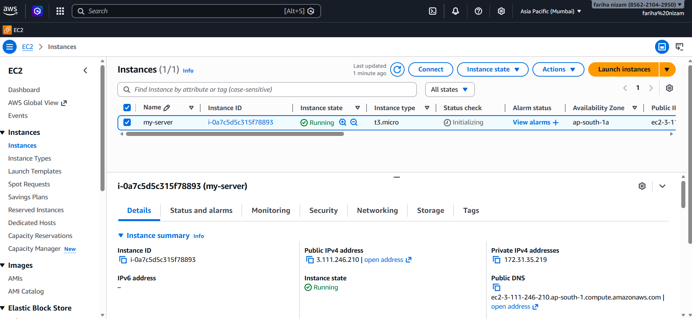
(Must show Region & AZ clearly)

✅ STEP 2 – Connect to Linux
📸 Screenshot Required:
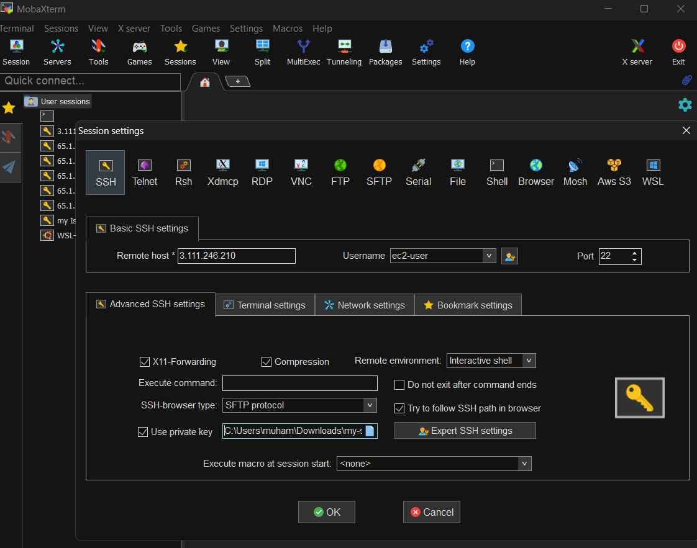

✅ STEP 3 – Create File in Root Volume

cd /home/ec2-user
sudo nano recovery_test.txt
Add: This file is created in ap-south-1a.
Recovery test file.

✅ STEP 4 – Verify File
ls -l
cat recovery_test.txt
📸 Screenshot Required:
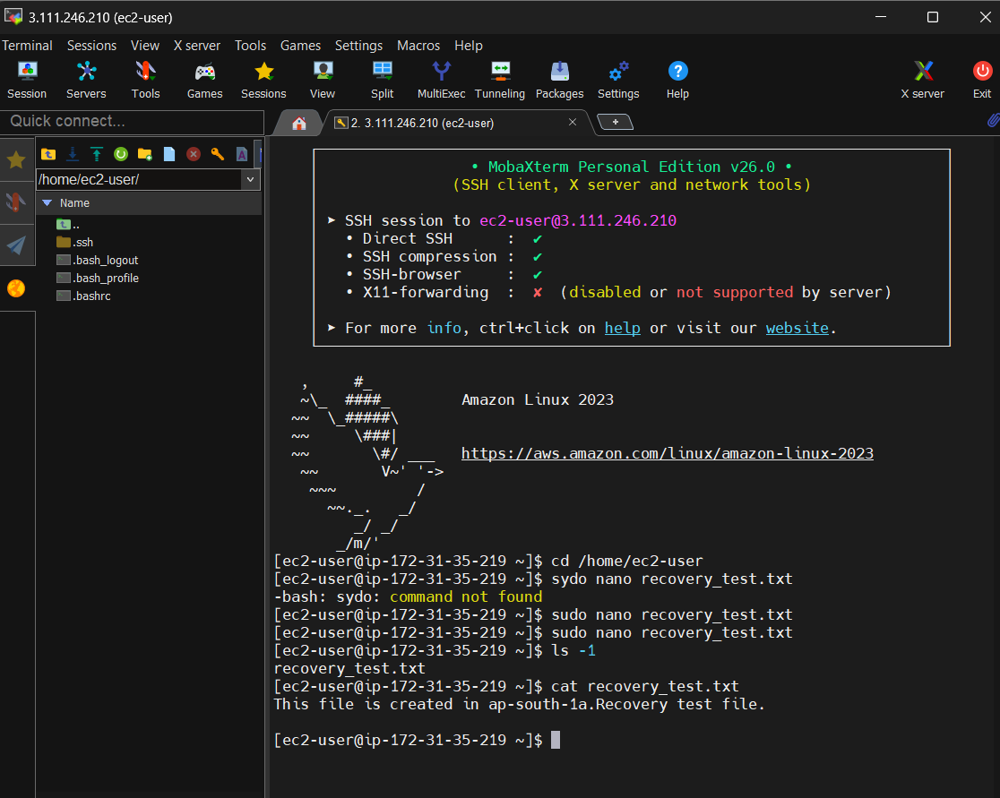

✅ STEP 5 – Create Snapshot

EC2 → Volumes → Select Root Volume → Create Snapshot

1️⃣ Select the Root Volume
In the Instance list, click the checkbox of your root volume

Method1
📸 Screenshot Required:
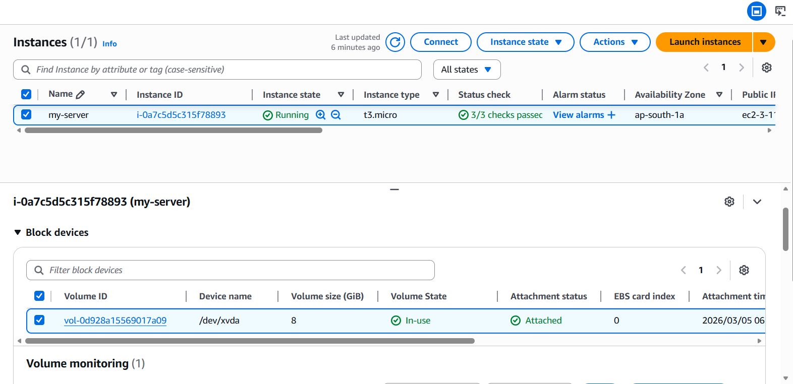

2️⃣ Select the Root Volume
In the Volumes list, click the checkbox of your volume

Method2
📸 Screenshot Required:
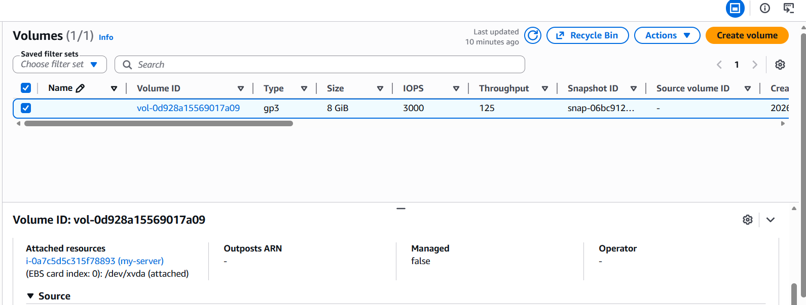

2️⃣ Click Create Snapshot

At the top menu click:

Actions → Create Snapshot

📸 Screenshot Required:

3️⃣ Fill Snapshot Details

A new page will open.

Fill these fields:

Description

Root volume snapshot for recovery test (ap-south-1a)

📸 Screenshot Required:
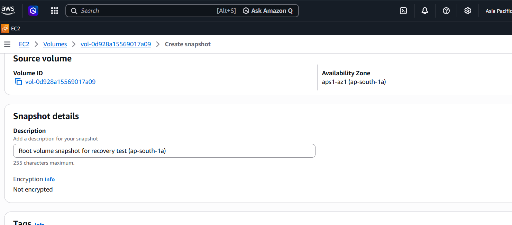

4️⃣ Click Create Snapshot

Click:

Create snapshot

AWS will now start creating the snapshot.

📸 Screenshot Required:
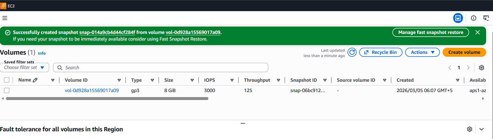

5️⃣ Go to Snapshots Page

Navigate to:

EC2 → Elastic Block Store → Snapshots

After a few seconds/minutes it will change to:

State: Completed

📸 Screenshot Required:
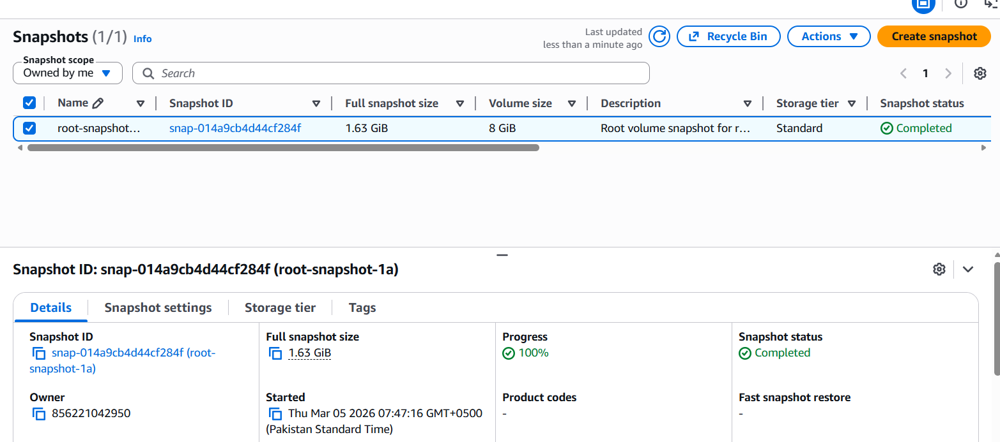

🧠 Important Concept (Good for Viva)

Snapshot is:

A backup of an EBS volume stored in Amazon S3

It allows you to:

. Recover data

. Create new volumes

. Migrate data across Availability Zones

✅ STEP 6 – Launch Recovery EC2 (1a)

Launch new instance in ap-south-1a

📸 Screenshot Required:
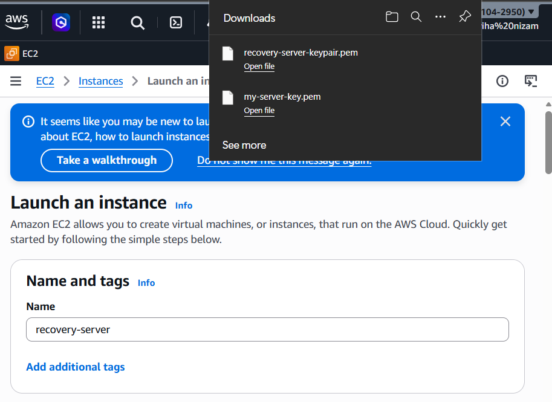

📸 Screenshot Required:
Recovery Server Launched
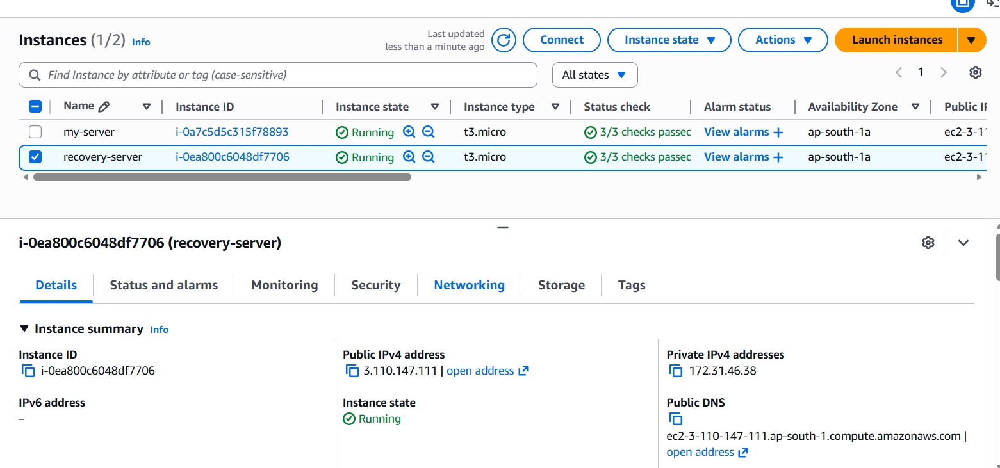

✅ STEP 7 – Create Volume from Snapshot (1a)

Snapshots → Create Volume → AZ = 1a

📸 Screenshot Required:
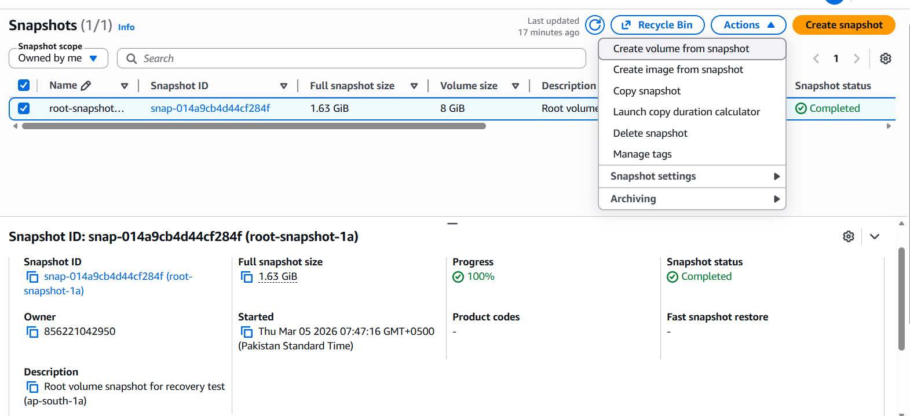

⚙️ Details Create Volume Page

Availability Zone ⭐ (VERY IMPORTANT)

Change this to:

ap-south-1a

This is required because your recovery instance will also be in 1a.

Click Add tag

Key: Name
Value: recovery-volume-1a

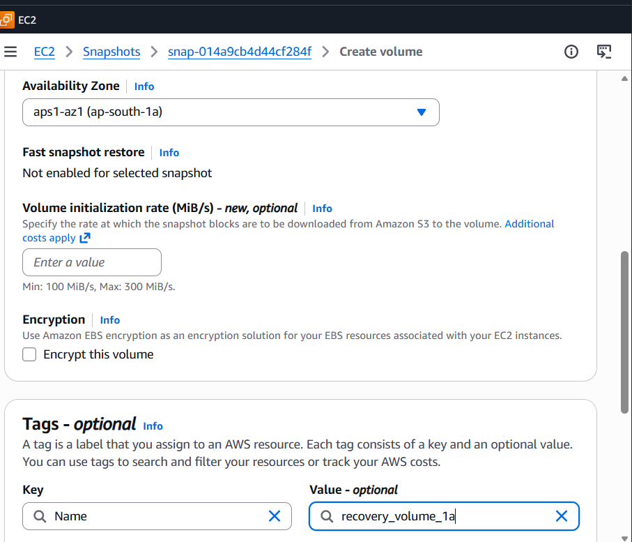

✅ Where to See the Created Volume

1️⃣ Go to Volumes

2️⃣ You will now see a new volume in the list
Look for something like:

. Volume ID: vol-xxxxxxxx

. Availability Zone: ap-south-1a

. State: Available

. Size: 8 GiB

. Type: gp3

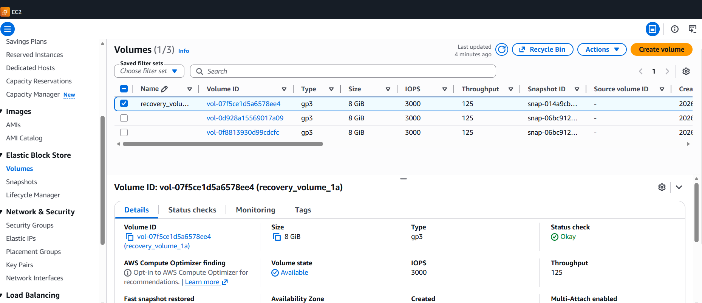

🔍 How to Identify the Correct Volume

Check these columns:

Snapshot ID

It should show the snapshot you used: snap-014a9cb4d44cf284f

✅ STEP 8 – Attach Volume

1️⃣ Go to Volumes

2️⃣ Select the Volume You Created

Click the checkbox next to the volume created from the snapshot.

3️⃣ Click Actions

Top right → click:

Actions → Attach Volume

3️⃣ In the Attach Window

You will see something like:
Instance
Select your recovery instance

4️⃣ In Device name field type:
Attach as: /dev/xvdf or
If AWS suggests options you may see:
/dev/sdf
/dev/sdg
/dev/sdh
These are AWS allowed device names and Linux converts them automatically.
These are equivalent. Linux will still show them as /dev/xvdf.

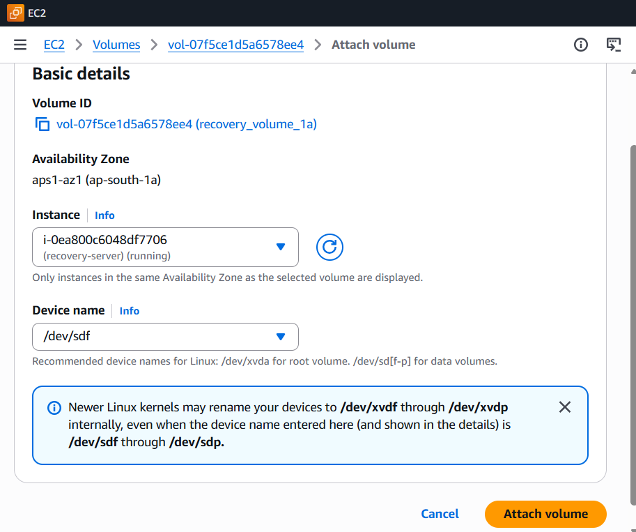

5️⃣ Click Attach Volume

After attaching, go back to Volumes page.

📸 Screenshot Required:

✅ STEP 9 – Mount & Verify
lsblk

✅ Step 1 – Connect to Recovery Instance

Use SSH (PuTTY, MobaXterm, or terminal) to connect to your recovery instance in ap-south-1a:
ssh -i key.pem ec2-user@<public-ip-of-recovery-instance>

✅ Step 2 – Run lsblk

At the Linux prompt, type:

lsblk
Then press Enter.

✅ lsblk Meaning

lsblk stands for List Block Devices.

. It is a Linux command.

. Used to show all the storage devices (disks/volumes) attached to your instance.

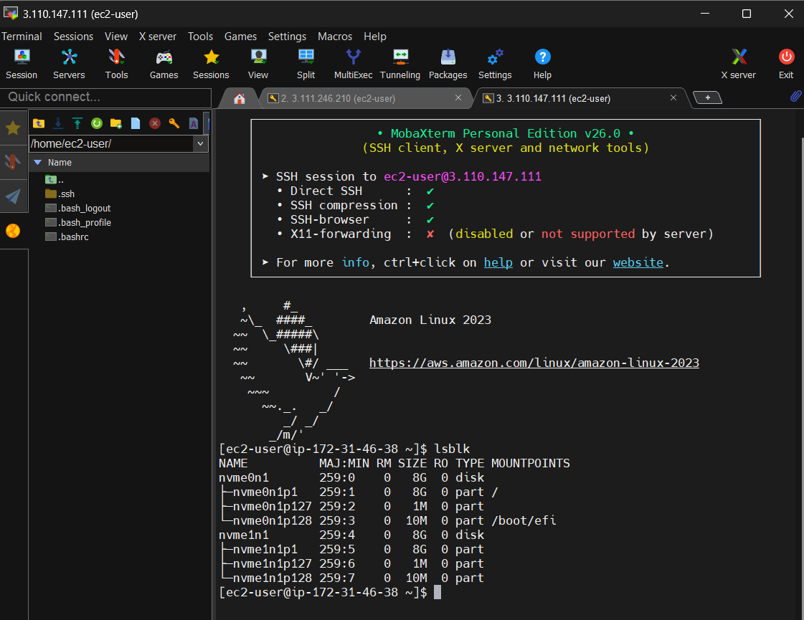

✅ Step 4 – Identify Your Volume

Your recovery volume is usually the one not mounted yet.

In this example:

xvdf   8G  disk
└─xvdf1 8G  part

This is the volume attached from your snapshot.

2️⃣ Match the key indicators

To find your snapshot volume, check three things:

A. Mountpoint

. nvme0n1p1 → mounted at / → this is the root of your current recovery instance.

B. Disk size

Both disks are 8G in this case, so size alone won't differentiate.

C. Which one you attached manually

. In STEP 8, you attached your snapshot volume as /dev/sdf → Linux maps it to nvme1n1

. So the second disk (nvme1n1) is your attached snapshot

3️⃣ How to confirm

Run:

sudo file -s /dev/nvme1n1

If it shows a filesystem (like ext4), it’s likely your snapshot volume.

output: /dev/nvme1n1: DOS/MBR boot sector, extended partition table (last)

Meaning

This tells us:

. /dev/nvme1n1 is a disk

. It contains partitions

. The filesystem is inside the partition, not directly on the disk.

So you must mount the partition, not the disk.

Your partition is:

nvme1n1p1

# After this, you can mount it:

Correct command to mount your volume

Create mount directory:
sudo mkdir /mnt/recovery

Mount the partition:
sudo mount -t xfs /dev/nvme1n1p1 /mnt/recovery

output:error

Step 1 — Run this command
sudo blkid

This will show something like:
/dev/nvme0n1p1 UUID="96e83033..." TYPE="xfs"
/dev/nvme1n1p1 UUID="96e83033..." TYPE="xfs"

Important thing to notice

Both volumes have the same UUID.

Now check your recovered file

Device	Meaning
/dev/nvme0n1p1	Root disk of the current recovery instance
/dev/nvme1n1p1	Snapshot volume you attached

Because they are clones, the UUID is identical.
XFS does not allow mounting two filesystems with the same UUID.

✅ Correct Fix (Required in AWS)

Mount using nouuid option.

Run this command:

sudo mount -t xfs -o nouuid /dev/nvme1n1p1 /mnt/recovery

This tells Linux:

Ignore the duplicate UUID and mount the disk.

After it mounts

Run:

Go to the EC2 user directory:
cd /mnt/recovery/home/ec2-user

List files:
ls

You should see:
recovery_test.txt

Then display it:
cat recovery_test.txt

Expected output:
This file is created in ap-south-1a.
Recovery test file.

📸 Screenshot Required:
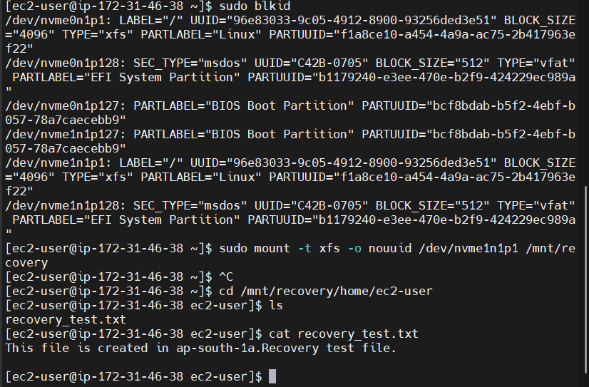

✅ After this step your EC2 recovery verification is complete.

✅ STEP 10 – Create Volume in 1b

Create volume from same snapshot
AZ = ap-south-1b

1. Go to AWS Console → EC2 → Snapshots

Find your snapshot: root-snapshot-1a (the one you created in 1a).

2. Select the Snapshot

Click the checkbox next to it.

3. Click “Create Volume”

Button is at the top-right.

5. Click “Create Volume from snapshot”

📸 Screenshot Required:

4. Fill the Volume Details

Field	Value
Volume Type	Same as original root volume (e.g., gp3)
Size	Same as snapshot (usually pre-filled, e.g., 8 GiB)
Availability Zone	ap-south-1b (change from 1a to 1b)
IOPS / Throughput	Keep default (or same as original)
Encryption	Keep same as snapshot (if unencrypted, leave unchecked)

 

✅ Where to see the new volume

. Go to EC2 → Volumes

. Filter by Availability Zone = ap-south-1b

. You should see a new volume created from your snapshot

. Volume ID will be different from the original

. Size and type will match snapshot

. Status: Available (not attached yet)

✅ STEP 11 – Attach to EC2 in 1b

Attach as secondary 

✅ STEP 11a – Launch EC2 in ap-south-1b

Go to AWS Console → EC2 → Launch Instances

Choose AMI: Same as original instance (e.g., Amazon Linux 2)

Instance Type: t2.micro (or same as original)

Network Settings → Availability Zone: ap-south-1b

Key Pair: Select existing key pair (same as 1a) or create new

Other settings: Leave defaults

Click Launch

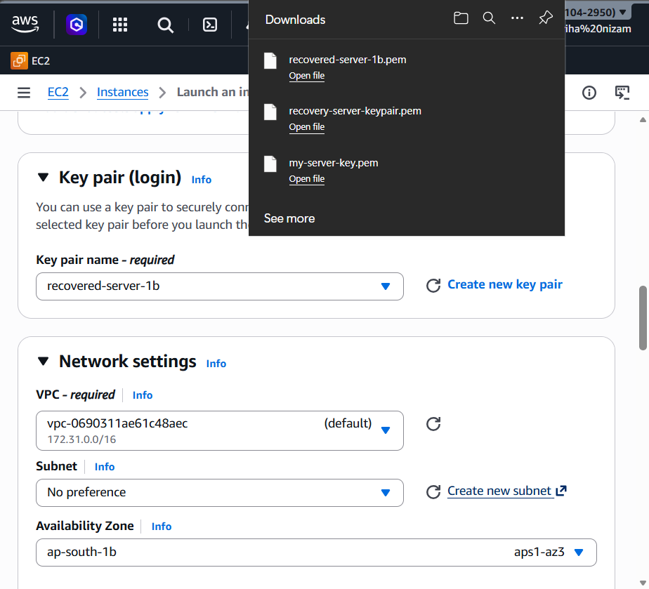

Wait until instance state = running.

✅ STEP 11b – Attach Volume to New EC2 in 1b

Now go to EC2 → Volumes

Select the snapshot-created volume in ap-south-1b

Actions → Attach Volume

Details Page:
Select the new 1b instance you just launched

Device name: /dev/sdf (AWS will map it automatically)

Click Attach

📸 Screenshot Required:

✅ STEP 12 – Verify Attachment

After attachment, SSH into the 1b instance:

1[connect to 1b](Method1_Recovery_Server\screenshots\connect_to_1b.png)     

3️⃣ Check Block Devices
lsblk

You should see:

1️⃣ Understanding lsblk output

. vme0n1 → This is your root volume of the 1b instance (where / is mounted).

. nvme1n1 → This is your recovery volume from 1a (the snapshot you attached).

. It has no mount yet, so MOUNTPOINTS is empty.

2️⃣ Mount the recovery volume

1. Create a mount point:
sudo mkdir /mnt/recovery

2. Mount the XFS recovery partition with nouuid (to avoid UUID conflict):

sudo mount -t xfs -o nouuid /dev/nvme1n1p1 /mnt/recovery

3. Go to EC2 user directory on the recovery volume:

cd /mnt/recovery/home/ec2-user

4. Verify your file is there:

ls

You should see:

recovery_test.txt

5. Display the contents:

cat recovery_test.txt

Expected output:

This file is created in ap-south-1a.
Recovery test file.

✅ After this, your STEP 12 verification is complete.

🧭 METHOD 2 – STEP BY STEP GUIDE

(Direct Snapshot Migration)

✅ STEP 2 – Create Migration File
cd /home/ec2-user
sudo nano migration_test.txt

✅ STEP 3 – Verify File
ls
cat migration_test.txt

📸 Screenshot Required:
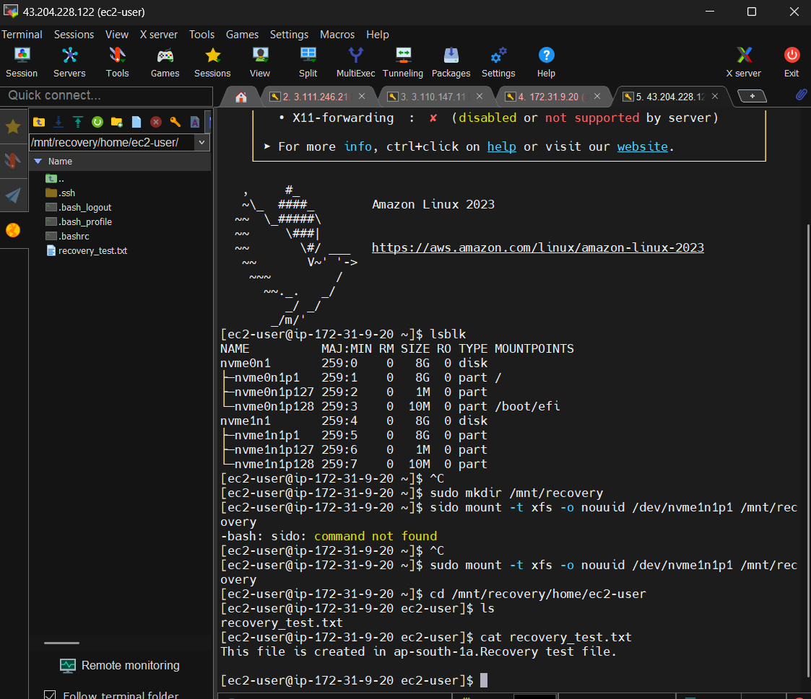

✅ STEP 5 – Create Volume in 1b

From Snapshot → Create Volume → AZ = 1b

📸 Screenshot Required:
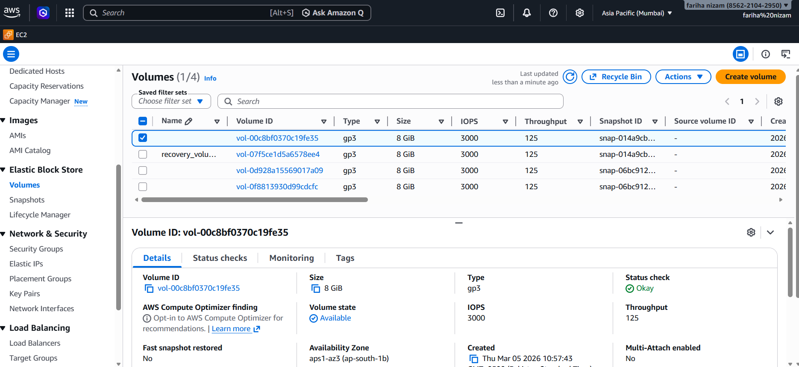

✅ STEP 6 – Attach to EC2 in 1b

📸 Screenshot Required:
1[attached volume in 1b](Method1_Recovery_Server/screenshots/attach_volume_1b.png)
✅ STEP 7 – Mount & Verify

sudo mkdir /mnt/migrated
sudo mount /dev/xvdf1 /mnt/migrated
cd /mnt/migrated/home/ec2-user
ls
cat migration_test.txt

📸 Screenshot Required:

✅ After this, your STEP 12 verification is complete.

🧭 METHOD 2 – STEP BY STEP GUIDE

(Direct Snapshot Migration)

✅ STEP 1 – Launch EC2 in 1a

📸 Screenshot Required:
01_launch_instance_1a.png

✅ STEP 2 – Create Migration File
cd /home/ec2-user
sudo nano migration_test.txt

📸 Screenshot Required:
02_create_file.png

✅ STEP 3 – Verify File
ls
cat migration_test.txt

📸 Screenshot Required:
03_verify_file.png

✅ STEP 4 – Create Snapshot

📸 Screenshot Required:
04_create_snapshot.png

✅ STEP 5 – Create Volume in 1b

From Snapshot → Create Volume → AZ = 1b

📸 Screenshot Required:
05_create_volume_1b.png

✅ STEP 6 – Attach to EC2 in 1b

📸 Screenshot Required:
06_attach_volume_1b.png

✅ STEP 7 – Mount & Verify
sudo mkdir /mnt/migrated
sudo mount /dev/xvdf1 /mnt/migrated
cd /mnt/migrated/home/ec2-user
ls
cat migration_test.txt

📸 Screenshot Required:
07_mount_verify.png

🏁 FINAL RESULT

After completing both methods:

✔ Data created in ap-south-1a
✔ Snapshot taken
✔ Recovery verified
✔ Migrated to ap-south-1b
✔ Data verified again

Assignment Complete ✅

